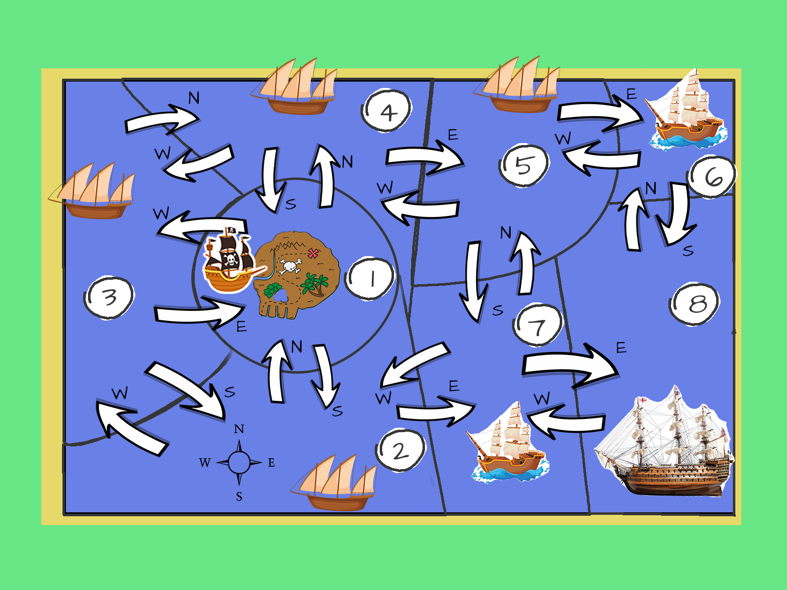

# Binary Studio Academy 2019

## Домашнее задание #4

### Требования
Вам необходимо разработать консольную игру "Pirates". 

Вы играете за пиратов (`PirateShip`) против королевского флота (`RoyalShip`).

Корабль имеет такие свойства:

```php
int strength // определяет наносимый урон (1 до 10)
int armour   // защиту к урону (1 - 10)
int luck     // определяет удачу попадания (1-10)
int health   // здоровье корабля (1 - 100)
array hold   // трюм корабля для добычи, вместительность: 3 элемента добычи.
```

У корабля должны быть команды:

```php
/**
 * @param int $direction - константа направления
 * 
 * Плыть в следующую гавань в заданном направлении
 */
public function setSails(int $direction);

/**
 * Выстрелить в корабль.
 */
public function fire();

/**
 * @param Ship $ship - побежденный корабль
 * 
 * Взять корабль на абордаж и собрать добычу с побежденного корабля. Добыча складывается в трюм корабля
 */
public function aboard(Ship $ship);
```

С побежденного корабля можно собрать сундук золота (`ChestGold`) или ром (`Rum`). Золото можно обменять на один из статов (силу, защиту или удачу), а за ром поднять здоровье на 30 единиц.

В игровом мире должно быть 8 гаваней:

- 1 пиратская гавань без вражеских кораблей, где начинается игра. Здесь же можно обменять сундуки с золотом.

- 4 гавани с патрульными шхунами (`Schooner`) с низкими статами:
    > strength: 2-5 \
    > armour: 2-5 \
    > luck: 1-5 \
    > health: 50

- 2 гавани с боевым флотом ее величества (`BattleShip`) со средними статами:
    > strength: 4-8 \
    > armour: 4-8 \
    > luck: 4-7 \
    > health: 80

- И 1 гавань с королевским фрегатом ее величества (`HerMajestyShipRoyalSovereign`) с самыми высокими статами:
    > strength: 10 \
    > armour: 10 \
    > luck: 10 \
    > health: 100

Возвращаться в каждую гавань разрешается неограниченное количество раз, и каждый раз там должен генерироваться новый корабль соответствующий гавани.

Если игрок проигрывает, то он возвращается в пиратскую гавань и с него снимается 10 единиц здоровья, и по одному стату от текущих.

Задача игры потопить королевский фрегат, после чего игра считается завершенной.

Команды игры:

- `help` - выводит список команд

- `stats` - выводит статы корабля и содержимое трюма

- `start` - начать игру. Игра начинается в гавани пиратов. Корабль изначально должен иметь низкие статы:

    > strength: 4 \
    > armour: 4 \
    > luck: 4 \
    > health: 60

- `set-sail <east|west|north|south>` - плыть в следующую гавань. Попав в гавань первый ход за игроком. Во время сражения также можно переплывать между гаванями.

- `fire` - выстрелить в корабль. Сражение происходит пошагово, сперва стреляет игрок, затем NPC. Вероятность попадания должна зависеть от удачи корабля. А нанесенный урон от силы и защиты.

- `aboard` - собрать добычу с побежденного корабля. 

- `buy <strength|armour|luck>` - купить 1 стат. Покупать статы можно только в пиратской гавани за сундуки с золотом.

- `drink` - выпить бутылку рома. Выпить ром считается за действие, т.е. нельзя выпить ром и атаковать. Или приплыть в королевскую гавань выпить ром и уплыть. После выпитого рома следующий шаг за вражеским кораблем.

- `exit` - завершить игру

Карта локаций и возможных перемещений:


