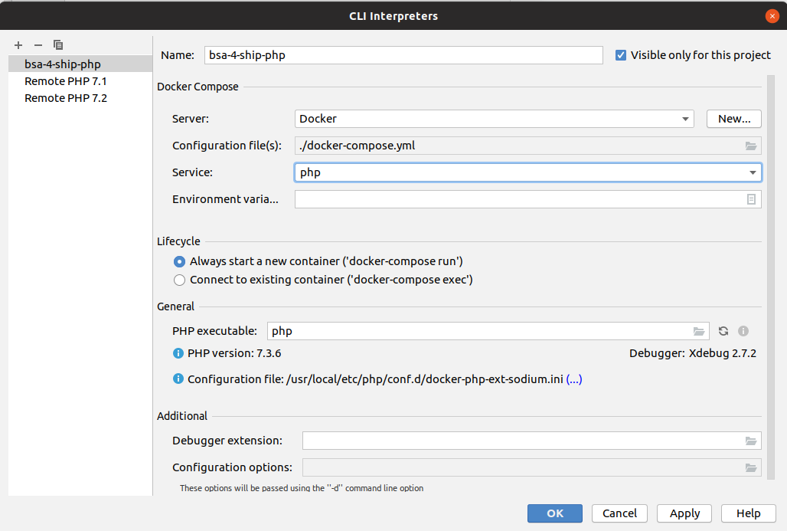

## How to set up XDebug in VS Code

1. First of all you need to install "PHP Debug" extension for VS Code.

    Go to extensions -> type "PHP Debug" -> Install

2. Change in [docker-compose.yml](docker-compose.yml) parameter `remote_host` in order to xdebug from container could connect to your host machine.
    It is IP address of your host machine inside container.

    Windows: it can be `10.0.2.2`. For Mac and Windows also should work `host.docker.internal`. If it didn't help you could try `docker-machine ssh default` (instead default can be name of docker machine) and see in log IP.

    Linux: run `ip addr show | grep docker0` or `ifconfig` and find IP address of your container. Usually it looks like `172.17.0.1`.
    
    Also, you can try to run `docker network inspect bridge` and find host address here.

    See: [docker container networking](https://docs.docker.com/v17.09/engine/userguide/networking/#default-networks)

3. Set up debugger in VS Code (`launch.json`). Config should look like this:

```json
{
    "version": "0.2.0",
    "configurations": [
        {
            "name": "Listen for XDebug",
            "type": "php",
            "request": "launch",
            "log": true,
            "port": 9000,
            "pathMappings": {
                "/app": "${workspaceFolder}"
            },
            "xdebugSettings": {
                "max_data": 65535,
                "show_hidden": 1,
                "max_children": 100,
                "max_depth": 5
            }
        }
    ]
}
```


4. Build container:

```bash
docker-compose build
```

5. Run debugger:


6. Set breakpoint in the editor and run script in a container:

```bash
docker-compose run --rm php php /app/game.php
```


## How to set up XDebug in PHPStorm

1. Setup remote CLI interpreter in settings




2. Create a game.php debug script


3. Set some breakpoint in the game.php


6. Start debug script.


### Troubleshooting:

In the root you will find `xdebug.log` that contains errors of xdebug in container.

In the "Debug console" of VS Code (Ctrl + Shift + Y) you will find log of local debugger.

If you use Virtual Box for your docker-machine you will need to forward ports in the settings to your virtual machine.


If volumes are not forwarded to container (folder /app/ is empty inside the container) try to move your project on system disk in the user directory (e.g. c:\Users\\<username\>\\).
